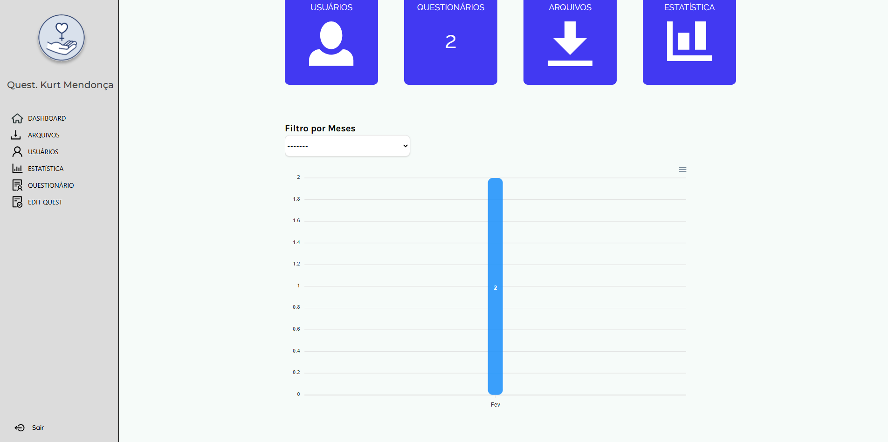

<p align="center">
 

  
</p>

<br>

<p align="center">
  
</p>


## 🚀 Tecnologias

Esse projeto foi desenvolvido com as seguintes tecnologias:
### Front-end
- JavaScript/TypeScript
- Next js
- Tailwind
- Shadcn-ui
- Ant Design

### Back-end
- Django Rest
- Sqlite

## 💻 Projeto

O Questionário Kurt Mendonça, é um sistema criado para rastrear sinais de violência psicóligica, atraves de um questionário de 15 questões.

## 👨‍💻 Como Rodar o Projeto Next.js

### Pré-requisitos

Certifique-se de ter os seguintes softwares instalados no seu sistema:

- **Node.js** (recomendado: versão 16 ou superior)
- **npm** (ou **yarn**)
#### Obs: Caso não tenha o Node instalado entre no site abaixo e baixe:

[Node](https://nodejs.org/pt/download)


### 1. Para Instalar as dependências use:

```bash
npm install 
```
ou
```bash
yarn
```

### 2. Para rodar o projeto use:

```bash
npm run dev 
```
ou
```bash
yarn dev
```
  - Irá abrir o link para acessar a página

## 🔖 Layout

Você pode visualizar o projeto através [desse link](https://kurtmendoncaquestionario.com/).

## :memo: Licença

Esse projeto está sob a licença MIT. Veja o arquivo [LICENSE](LICENSE.md) para mais detalhes.